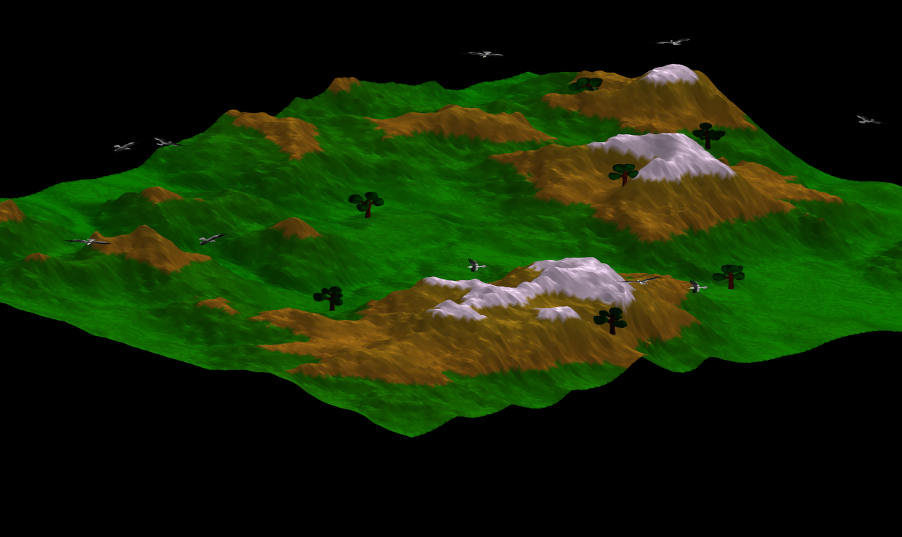
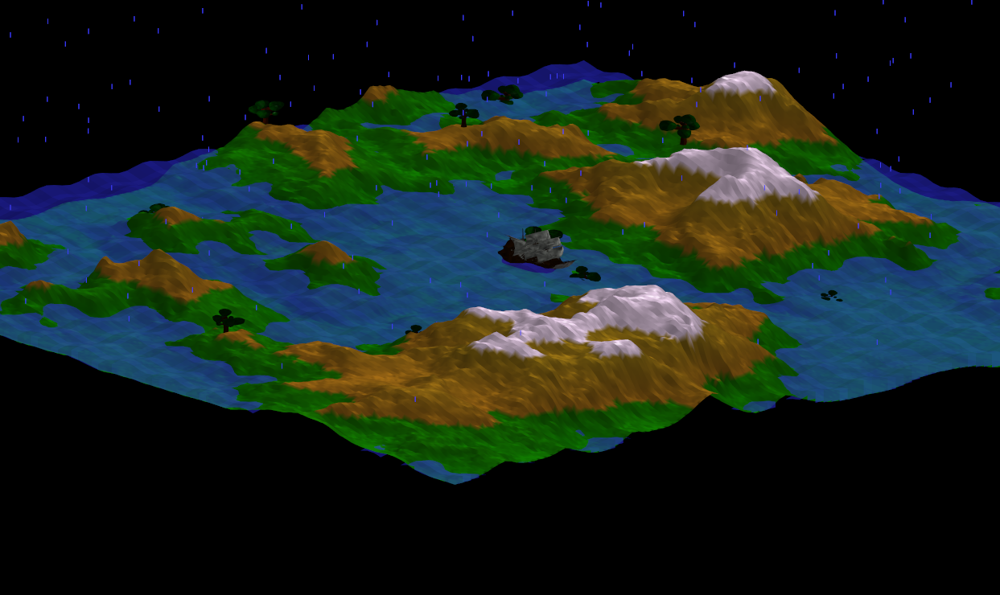

- Les controles :
 - controles de base pour tout ce qui est zoom/dezoom/rotation
 - rotation de la camera à la souris, il faut cliquer sur une fenêtre pour capturer le curseur
 - echap permet de libérer le curseur
 - tab quitte toutes les fenêtres
 - F5 pour le chargement
 - F6 pour la sauvegarde (il faut que les 4 fenêtres soient lancées pour pouvoir sauvegarder)

- J'ai choisis de ne pas sauvegarder tous les vertices de la map par soucis de taille du fichier de sauvegarde, mais plutot de sauvegarder l'état du jeu, c'est à dire la map chargée, la saison, la hauteur de l'eau, l'avancement dans l'été... La position des particules n'est évidemment pas sauvegardée

- La sauvegarde des attributs de chaque saison se fait de la sorte :

        QVector<data *> Drought::attributes()
        {
          QVector<data *> att;
          att.push_back(ResourceManager::FLOAT(&yellow));
          att.push_back(ResourceManager::FLOAT(&snowHeight));
          att.push_back(ResourceManager::BOOL(&isActive));
          return att;
        }

On retourne un tableau de pointeurs vers les attributs, ce qui permet de les sauvegarder simplement avec leur valeur, mais cela permet également de les affecter lors du chargement.

data est une struct qui permet de sérialiser tout type de données, un pointeur sur void permet de contenir n'importe quel type, la fonction toString est donnée à la construction de l'objet pour savoir comment le sérialiser et enfin une information sur le type est conservée pour l'affectation, void* perdant cette information.

     struct data {
     	void *valuePtr;
	    std::function<QString()> toString;
	    int type;
     };

Exemple de fonction permettant le chargement et la sauvegarde d'un float

     data *ResourceManager::FLOAT(float *value)
     {
          data *d = new data();
	  	  d->valuePtr = value;
	      d->type = _float;
	      d->toString = [=]() {
	  	      QString s = "FLOAT:";
	  	      return  s + QString::number(*value) + ";";
	  };
	  return d;
     }

- En plus du fichier de l'arbre, j'ai ajouté un bateau pour l'hiver et des oiseaux en été. Ils ont respectivement 13 000 et 15 000 vertices, ce qui impact grandement les performances, c'est surtout du au fait que j'utilise opengl en mode direct, il est conseillé de fermer autres fenêtres pour profiter d'un nombre d'image par secondes maximal

- Le bateau se promène sur la map dès qu'il y a assez d'eau en évitant au maximum les montagnes, il se tourne dans le sens de sa direction.

